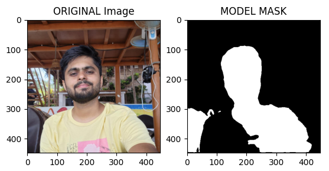
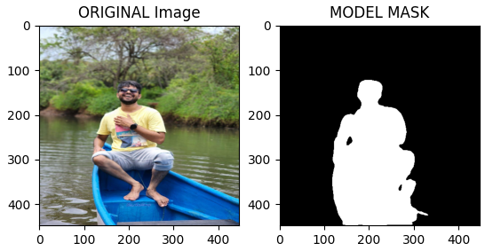
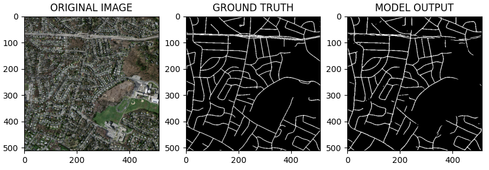
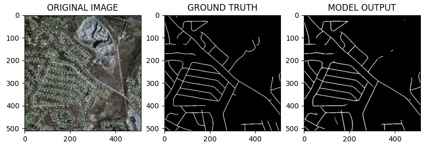

# U-Net-for-Image-Segmentation
Welcome to the U-Net-for-Image-Segmentation repository. This repository contains the implementation of U-Net for Human and Areial (Massachusetts Roads) segmentation using segmentation_models_pytorch library.


## Aerial & Human-Segmentation
1. **Clone this Repository**

``` bash
git clone https://github.com/Shyamal-Dharia/U-Net-for-Image-Segmentation.git

cd U-Net-for-Image-Segmentation
```

2. **Download this datasets from these Repositories**
 
- For Human-Segmentation
``` bash
git clone https://github.com/parth1620/Human-Segmentation-Dataset-master.git
```
- For Aerial-Segmentation

``` bash
git clone https://github.com/parth1620/Road_seg_dataset.git
```
3. **Train U-Net**
``` bash
cd src-human-segmentation

or

cd src-aerial-image-segmentation

python train.py
```
After training the model, the best-performing model is saved in the "model" folder. Subsequently, you can use the "test.py" script to evaluate this model on your own images.


## Results


### Human-Segmentation using U-Net





### Aerial-Segmentation using U-Net





## Reference:

Implementation Human-Segmentation guide: https://github.com/parth1620/Human-Segmentation-Dataset-master

Implementation Human-Segmentation guide: https://github.com/parth1620/Road_seg_dataset

Human-Segmentation-Dataset Credit : https://github.com/VikramShenoy97/Human-Segmentation-Dataset

Aerial-Segmentation-Dataset Credit: This dataset is derived from Volodymyr Mnih's original Massachusetts Roads Dataset. Massachusetts Roads Dataset & Massachusetts Buildings dataset were introduced in Chapter 6 of his PhD thesis. If you use this dataset for research purposes you should use the following citation in any resulting publications:

``` bash
@phdthesis{MnihThesis,
    author = {Volodymyr Mnih},
    title = {Machine Learning for Aerial Image Labeling},
    school = {University of Toronto},
    year = {2013}
}
```

Full dataset is available: https://www.cs.toronto.edu/~vmnih/data/

## Contribution
Contributions to this repository are welcome! Whether you want to add more architectures, share your fine-tuning results, or improve the documentation.

## License

This project is licensed under the [MIT License](https://github.com/Shyamal-Dharia/U-Net-for-Image-Segmentation/blob/main/LICENSE) - see the [LICENSE](https://github.com/Shyamal-Dharia/U-Net-for-Image-Segmentation/blob/main/LICENSE) file for details.
